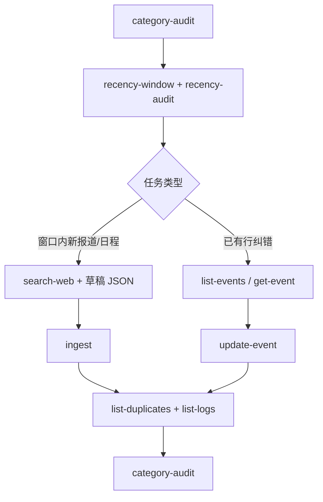

# 宏观事件库维护（maintain-events）

## 何时启用本技能

- 用户要求入库、改分类、补 `summary`/`country`、审计 `category`、解释 ingest 跳过原因
- 从网页搜集宏观/央行/经济/加密新闻并写入库
- 维护会话结束需证明 `category-audit` 与 `list-logs` 无异常

**禁止**：直接编辑 `.sqlite3`；用 `update-event` 修改去重指纹字段；用 `update-event` 把重复稿「合并」进已有行。

## 前置条件

| 项 | 说明 |
|----|------|
| 工作目录 | 项目根 `macro_maintainer` |
| 依赖 | `pip install -e ".[dev]"` |
| 语义去重（可选） | `pip install -e ".[mem0]"`；`.env` 见 `.env.example`（`MEM0_ENABLED`、`DASHSCOPE_API_KEY` 等） |

### SSOT（细则以规则文件为准，本技能只给操作步骤）

| 主题 | 文件 |
|------|------|
| `category` 注册与合法值 | `.cursor/rules/event_category.mdc` |
| `ingest` 去重指纹、重复判定、`reason` | `.cursor/rules/事件入库去重规则.mdc` |
| 信息采集、字段整理、草稿格式、纠错流程、会话交付 | `.cursor/rules/event_rules.mdc` |

Mem0 长期向量默认 `MEM0_TTL_DAYS=30`（`expires_on`）；Cursor 对话**不是**去重库。

---

## CLI 命令索引

```powershell
python -m event_maintainer.main <子命令> [参数]
```

| 子命令 | 用途 |
|--------|------|
| `init-db` | 建表/校验 schema（新环境首次） |
| `db-status` | 三表行数 |
| `category-audit` | 分类 vs 注册表（维护前/后必跑） |
| `list-events` | 全表枚举（筛 `category`、取 `id`） |
| `get-event <uuid>` | 单条详情 |
| `recency-window` | 维护窗口（默认过去 72h + 未来 7d）与 `suggested_searches` |
| `recency-audit` | 库内事件分为 `recent` / `upcoming` / `outside_window` |
| `list-events --maintenance-window` | 仅列出窗口内事件（含 `recency_phase`） |
| `search-web --query "..."` | DuckDuckGo HTML（可加 `--json`、`--count`、`--offset`） |
| `ingest --input drafts.json` | 批量入库 |
| `update-event --id <uuid>` | 仅 `category` / `summary` / `country` |
| `list-duplicates` | 重复跳过记录（含 `reason`、`score`） |
| `list-logs` | `maintenance_logs`（含 `rejected`） |

iOS 只读 API（不写库）：`uvicorn apps.api.main:app --reload`；契约见 `docs/FRONTEND_DATA_ACCESS.md`。

---

## 标准维护会话



### 时效性窗口（默认必守）

| 范围 | 默认 | 含义 |
|------|------|------|
| 已发生 | 过去 **72 小时** | 数据公布、央行声明、已落地的行情/政策 |
| 将发生 | 未来 **7 天** | 发布会、FOMC、CPI/非农等预定公布、央行讲话 |

- 环境变量：`MAINTENANCE_PAST_HOURS`、`MAINTENANCE_FUTURE_DAYS`（见 `.env.example`）
- `ingest` 的 `event_time` 必须落在上述窗口；窗口外仅 `update-event` 纠错，不主动扩库
- 维护前：`recency-window` → `recency-audit`；维护后：`list-events --maintenance-window`

1. `category-audit` — 处理 `empty` / `alias_only` / `unregistered_in_db`（见下表）
2. `recency-window` + `recency-audit` — 按 `recent` / `upcoming` 缺口安排 `search-web`
3. 按任务执行 `search-web`→草稿→`ingest`，和/或 `update-event`
4. `list-duplicates`（若有 ingest）、`list-logs`、`list-events --maintenance-window`、`db-status`
5. 再次 `category-audit` — `needs_maintenance` 应为 false

### 维护前必拉信息

| 命令 | Agent 须提取 |
|------|--------------|
| `category-audit` | `needs_maintenance`、`issues` 及 `suggest` |
| `list-events` | 目标 `label` 下每条 `id`、`category`、`title` |
| `get-event <uuid>` | 当前 `category` / `summary` / `country` 及缺字段 |
| `search-web` | 标题、来源、时间、正文摘录（供草稿指纹字段） |
| `list-logs` | 意外 `rejected` |
| `list-duplicates` | 每条 `skipped` 的 `reason`（解读见去重规则） |

### category-audit 问题处理

| `issues` 类型 | 含义 | 做法 |
|---------------|------|------|
| `empty` | `category` 为空 | `update-event --category <已注册 label>` |
| `alias_only` | 写了 alias 而非中文 label | `update-event --category <audit.suggest>` |
| `unregistered_in_db` | 库里有未注册字符串 | 注册表新增 label **或** `update-event` 到最近似 label |
| `registered_missing_in_db` | 注册表有 label、库中零条 | **不能**单靠 `update-event`；须 `ingest` 或从其它分类迁入 |

当前注册 `label`（写入须**精确**中文）：`央行`、`宏观`、`经济`、`加密货币`。`aliases` 仅 audit 建议，**禁止** ingest/update 写入。

---

## 字段与命令边界

完整字段表见 `event_rules.mdc` §2。摘要：

| 场景 | 命令 |
|------|------|
| 只改 `category` / `summary` / `country` | `update-event`（至少一个可选参数） |
| 新报道 | `ingest`（草稿 JSON 数组） |
| 改 `title` / `source` / `event_time` / `raw_content` | **禁止** `update-event` → 见去重规则 |
| ingest 被跳过 | `list-duplicates` + `list-logs`；**不要** `update-event` 合并 |
| 补 `content` / `analysis` / `symbols` / `key_metrics` 等 | 当前 CLI **不支持** update；`ingest` 时带齐或记 `field_completion` pending |

**`raw_content` vs `content`**：`raw_content` 为来源原文且参与去重指纹；`content` 为整理后展示正文（可选，缺省入库时回填 `raw_content`）。

去重指纹、`ingest` 判定顺序、`reason` 枚举 → **仅**查 `.cursor/rules/事件入库去重规则.mdc`。

---

## 草稿 JSON（ingest 输入）

文件为 **JSON 数组**。必填：`title`、`source`、`event_time`、`raw_content`。其余字段见 `event_rules.mdc` §2.2。

示例（单条，全字段；实际可省略可选键）：

```json
[
  {
    "title": "美联储维持利率不变",
    "source": "Reuters",
    "event_time": "2026-05-15T18:00:00Z",
    "raw_content": "The Federal Reserve decided to maintain the target range for the federal funds rate at 5-1/4 to 5-1/2 percent…",
    "summary": "点阵图偏鹰，年内降息预期下调",
    "content": "美联储在 5 月议息会议上决定维持联邦基金利率目标区间 5.25%–5.50% 不变。声明指出通胀仍偏高…",
    "country": "US",
    "category": "央行",
    "importance_score": 0.95,
    "impact_score": 0.88,
    "symbols": ["US500", "DXY", "TLT", "GC"],
    "analysis": "维持利率符合预期，但点阵图下调降息次数，短端利率与美元偏强，黄金承压。",
    "end_time": "2026-05-15T19:30:00Z",
    "key_metrics": [
      {
        "id": "fed-funds-upper",
        "name": "联邦基金利率上限",
        "value": "5.50",
        "previous_value": "5.50",
        "change": 0.0,
        "unit": "%"
      }
    ],
    "related_event_ids": ["550e8400-e29b-41d4-a716-446655440001"],
    "extras": {
      "meeting": "FOMC",
      "statement_url": "https://www.federalreserve.gov/…"
    }
  }
]
```

```powershell
python -m event_maintainer.main ingest --input drafts.json
```

`ingest` 输出 JSON（`inserted` / `skipped` / `rejected`）；随后必查 `list-logs` 中 `rejected`。

---

## 典型场景速查

### A. 从网络批量补事件

```powershell
python -m event_maintainer.main category-audit
python -m event_maintainer.main recency-window
python -m event_maintainer.main recency-audit
python -m event_maintainer.main search-web --query "US economic calendar releases next week May 2026" --count 10 --json
# 维护者据结果编写 drafts.json（category 用 label）
python -m event_maintainer.main ingest --input drafts.json
python -m event_maintainer.main list-duplicates
python -m event_maintainer.main list-logs
python -m event_maintainer.main category-audit
```

### B. 仅纠正已有行分类/摘要/国家

```powershell
python -m event_maintainer.main category-audit
python -m event_maintainer.main list-events
python -m event_maintainer.main update-event --id <uuid> --category 宏观 --summary "..." --country US
python -m event_maintainer.main get-event <uuid>
python -m event_maintainer.main category-audit
```

### C. 新增注册分类

1. 编辑 `event_category.mdc` frontmatter `categories`
2. 若 iOS 需独立色/图标 → `docs/FRONTEND_DATA_ACCESS.md`
3. `ingest` 至少一条该 `category`，或批量 `update-event` 迁入
4. `category-audit` 直至无 `registered_missing_in_db` / `unregistered_in_db`

### D. 解释「为什么没入库」

```powershell
python -m event_maintainer.main list-duplicates
python -m event_maintainer.main list-logs
python -m event_maintainer.main get-event <duplicate_event_id>
```

按去重规则中的 `reason` 解释；勿建议改指纹字段去「蹭」已有行。

---

## 分类边界（维护者判断）

- 语义与 `examples` 以 `event_category.mdc` 为准；边界不清时选**最接近**的已注册 `label`
- 仅改分类、不改事实字段时，只动 `--category`
- 边界不清：优先最接近项；必要时扩 `examples` 或新增 `label`（走场景 C）

---

## 验证清单（交付前）

- [ ] `category-audit`：`needs_maintenance` 为 false（或已说明遗留项）
- [ ] `list-logs`：无意外 `rejected`（`update_event` / `ingest`）
- [ ] 若有 ingest：`list-duplicates` 已解释每条 `skipped`（引用去重规则）
- [ ] 未改 `.sqlite3`；未用 `update-event` 动指纹四字段
- [ ] schema/API 变更后：`pytest`

### 会话交付（向用户说明）

| 输出项 | 内容 |
|--------|------|
| 目标分类 | 本次维护的 `label`（可多个） |
| 已执行命令 | 实际运行的 CLI 子命令 |
| 变更摘要 | `update-event` 的 `id` 与字段；`ingest` 计数 |
| 审计结果 | 末次 `category-audit` 的 `needs_maintenance` 与残留 `issues` |
| 异常 | `list-logs` 中 `rejected`；`list-duplicates` 中 `skipped` 及 `reason` |

---

## 与项目其它文档

| 文档 | 职责 |
|------|------|
| `event_category.mdc` | 分类注册表 SSOT |
| `事件入库去重规则.mdc` | 去重 SSOT |
| `event_rules.mdc` | 按分类维护：信息采集、字段、格式、流程、交付 |
| `MODULE_GUIDE.md` | 模块边界（CLI / db / dedup / api） |
| `macro-maintainer.mdc` | 仓库级约束（三表、禁 agent 管道） |
| **本技能** | 操作步骤、场景速查、验证清单；细则以三份 `.mdc` 为准 |

---

## 无人值守（本机 Windows）

定时由 **任务计划程序** 调用 Cursor Agent CLI，发送与「更新数据库」等价的维护提示词；Agent 按本技能与三份 `.mdc` 决策，写库仍仅经 `python -m event_maintainer.main`。

### 前置条件

| 项 | 说明 |
|----|------|
| Cursor Agent CLI | 独立命令 `agent`（或 `cursor-agent`）在 PATH；`agent login` 已完成（勿用编辑器 `cursor.cmd` 代替） |
| Python | 项目根 `pip install -e ".[dev]"`（可选 `".[mem0]"` + `.env`） |
| 权限 | [`.cursor/cli.json`](../cli.json) 已放行 `python -m event_maintainer.main *` |
| 机器 | 触发时段 PC 开机且用户已登录（默认定时任务为交互式登录） |

### 文件

| 路径 | 用途 |
|------|------|
| `scripts/prompts/update-database.txt` | 无人值守提示词 SSOT |
| `scripts/run-maintain-agent.ps1` | 单次运行：无头 `agent -p` + 日志 |
| `scripts/register-scheduled-task.ps1` | 注册/卸载计划任务 `MacroMaintainer-UpdateDatabase` |
| `scripts/logs/` | 运行日志（gitignore） |
| `scripts/.runtime/` | 定时 ingest 草稿 JSON（gitignore） |

### 手动试跑

```powershell
cd <项目根>
agent status
.\scripts\run-maintain-agent.ps1
```

日志：`scripts/logs/maintain-<timestamp>.log`（可读过程）+ `maintain-<timestamp>.jsonl`（原始 stream-json）。默认解析 `[TOOL]` / `[ASSISTANT]` / `[THINK]` / `[RESULT]`。要思考链：`.\scripts\run-maintain-agent.ps1 -AgentModel claude-4.6-sonnet-medium-thinking`。旧纯文本：`-PlainText`。排错时可加 `-SkipStatusCheck`。

### 注册每日任务

```powershell
.\scripts\register-scheduled-task.ps1              # 默认每天 08:00
.\scripts\register-scheduled-task.ps1 -At "09:30"
.\scripts\register-scheduled-task.ps1 -EveryMinutes 10   # 每 10 分钟（重叠则跳过）
.\scripts\register-scheduled-task.ps1 -Unregister   # 卸载
```

验收：任务计划程序 → 找到 `MacroMaintainer-UpdateDatabase` → **立即运行** → 检查 `scripts/logs/` 与 `category-audit` / `list-logs`。

### 风险

- 脚本使用 `--force` 自动批准 Shell；仅建议在可信本机运行。
- Agent 可能耗时较长；计划任务默认最长 3 小时，失败可重试 1 次（间隔 30 分钟）。
