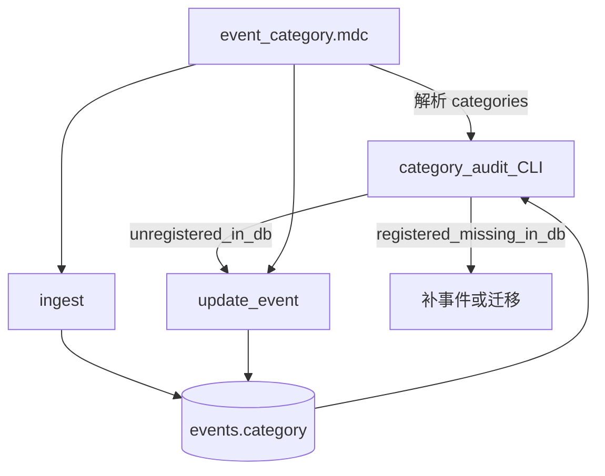

# macro_maintainer 分类维护规则与 CLI 补齐（修订）

## 用户约束（本次迭代）

- **分类必须在** [`macro_maintainer/.cursor/rules/event_category.mdc`](macro_maintainer/.cursor/rules/event_category.mdc) **中注册**。
- **注册表 → 数据库**：文件中列出的每个分类，数据库中**必须有**（至少一条 `events.category` 使用该值；维护任务包含为「空注册分类」补事件或迁移事件）。
- **数据库 → 注册表**：库中出现的 `category` 值**必须**已在 `event_category.mdc` 注册；未注册值视为违规，需 `update-event` 映射到已注册分类，或先在文件中注册后再保留。
- **新增分类**：**先**改 `event_category.mdc` 注册，再 `ingest` / `update-event`；禁止未注册值写入 DB。

当前文件仅有 frontmatter（`alwaysApply: true`），实施时需补全注册表正文。

---

## 架构：单一注册源



**不再新增** `category-maintenance.mdc`；工作流与枚举说明集中在 `event_category.mdc`，[`macro-maintainer.mdc`](macro_maintainer/.cursor/rules/macro-maintainer.mdc) 仅增加一行指向注册表文件。

---

## 1. `event_category.mdc` 内容与格式

**Frontmatter**（保持 `alwaysApply: true`，并增加可解析字段）：

```yaml
---
description: 宏观事件 category 注册表与维护约定
alwaysApply: true
categories:
  - label: 央行
    aliases: [monetary_policy, central_bank]
    examples: 利率决议、FOMC、QE
  - label: 宏观
    aliases: [macro]
    examples: 通胀、GDP、财政政策
  - label: 经济
    aliases: [labor_market, economy]
    examples: 非农、PMI、零售
  - label: 加密货币
    aliases: [crypto]
    examples: 监管、ETF、稳定币
---
```

**正文（Markdown，给人读）**：各分类说明、映射规则、新增分类 checklist（同步 [`docs/FRONTEND_DATA_ACCESS.md`](macro_maintainer/docs/FRONTEND_DATA_ACCESS.md) 与 iOS `EventCategory`）。

### 1.1 维护职责（写入规则正文）

| 检查项 | 含义 | 处理 |
|--------|------|------|
| `registered_missing_in_db` | 注册表有、DB 无事件 | 补 ingest 或把其它分类事件 `update-event` 迁入 |
| `unregistered_in_db` | DB 有、注册表无 | 先注册或 `update-event` 到已注册 `label` |
| `empty_category` | `category` 为空 | `update-event` 补全 |
| `alias_only` | 仍为 alias 字符串 | 映射为对应 `label` |

### 1.2 新增分类顺序（强制）

1. 编辑 `event_category.mdc` → `categories` 增加 `label`（及 `aliases`）
2. 更新 `FRONTEND_DATA_ACCESS.md` §分类枚举（若 iOS 需展示）
3. `ingest` 至少一条该分类事件 **或** 批量 `update-event`
4. `category-audit` 直至 `registered_missing_in_db` 与 `unregistered_in_db` 为空

### 1.3 标准 CLI 工作流

```powershell
python -m event_maintainer.main category-audit
python -m event_maintainer.main list-events
python -m event_maintainer.main update-event --id <uuid> --category 央行
python -m event_maintainer.main ingest --input drafts.json
python -m event_maintainer.main list-logs
```

`macro-maintainer.mdc` 增补：

> 分类注册表：`.cursor/rules/event_category.mdc`；维护前运行 `category-audit`。

---

## 2. CLI 实现（与注册表联动）

### 2.1 解析注册表

- 模块：`event_maintainer/category/registry.py`
- 默认路径：项目根下 `.cursor/rules/event_category.mdc`（可通过 `EVENT_CATEGORY_REGISTRY` 覆盖）
- 解析 frontmatter `categories[].label` 为**允许写入**集合；`aliases` 仅用于 audit 建议映射，**不得**作为 ingest 目标值

### 2.2 `category-audit` 输出（修订）

```json
{
  "registry_path": ".cursor/rules/event_category.mdc",
  "registered": ["宏观", "经济", "央行", "加密货币"],
  "counts": { "央行": 12, "monetary_policy": 3 },
  "issues": {
    "registered_missing_in_db": ["宏观"],
    "unregistered_in_db": [{ "id": "...", "category": "unknown" }],
    "empty": ["..."],
    "alias_only": [{ "id": "...", "category": "monetary_policy", "suggest": "央行" }]
  },
  "needs_maintenance": true
}
```

### 2.3 `update-event` / `ingest` 校验

- `ingest` / `update-event --category X`：`X` 必须等于某条 `categories[].label`（精确匹配中文 `label`）
- 未注册 → 拒绝写入 + `maintenance_logs` `status=rejected`
- `update-event` 仍禁止修改 dedup 指纹字段（`title`/`source`/`event_time`/`raw_content`）

---

## 3. 目标文件（修订）

| 文件 | 动作 |
|------|------|
| [`.cursor/rules/event_category.mdc`](macro_maintainer/.cursor/rules/event_category.mdc) | **SSOT**：frontmatter `categories` + 维护工作流正文 |
| [`.cursor/rules/macro-maintainer.mdc`](macro_maintainer/.cursor/rules/macro-maintainer.mdc) | 指向 `event_category.mdc` |
| ~~category-maintenance.mdc~~ | **取消** |
| `event_maintainer/category/` | `registry.py`, `audit.py`, `taxonomy.py` |
| `event_maintainer/main.py` | `category-audit`, `update-event` |
| `event_maintainer/maintenance/service.py` | ingest 前 registry 校验 |
| `MODULE_GUIDE.md` / `maintain-events/SKILL.md` | 注册表路径与 audit 步骤 |
| `tests/` | audit 双向问题 + ingest 拒绝未注册 |

**不修改**：`apps/api/`、不新增第 4 张业务表。

---

## 4. 与 iOS 契约的关系

- 初始 `categories[].label` 与 [`FRONTEND_DATA_ACCESS.md`](macro_maintainer/docs/FRONTEND_DATA_ACCESS.md) 四分类对齐。
- 在 `event_category.mdc` 新增 `label` 时，文档中注明：若需独立 UI 色/图标，必须同步 iOS；否则客户端仍可能显示为「其他」。

---

## 5. 交付顺序

1. 写好 `event_category.mdc` 注册表（含四分类 + aliases）
2. `registry.py` + `category-audit` + `update-event` + ingest 校验 + 测试
3. `macro-maintainer.mdc` / Skill / MODULE_GUIDE 交叉引用

---

## 6. 风险与边界

- **空注册分类**：注册后无事件会一直被 audit 标红，属预期，直到补数据。
- **双源同步**：注册表仅在 `event_category.mdc`；Python 运行时读取该文件，避免在代码里硬编码第二份列表（测试可用临时 registry 文件）。
- **批量纠错**：仍通过多次 `update-event`，不新增 `bulk-update`。
