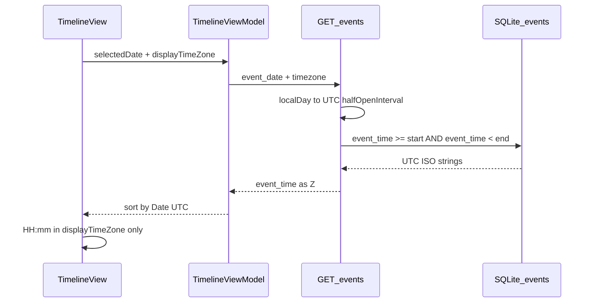

# 前端数据访问指南（MacroEvent iOS）

本文档描述 **MacroEvent iOS 客户端**所依赖的 REST API 契约，并与本仓库 **`apps/api/`**（FastAPI 只读层）及 **`events` 三表 SQLite** 实现保持一致。后端联调、字段变更应同步更新本文与 `apps/api/schemas/frontend.py`。

## 概述

| 项 | 说明 |
|----|------|
| 数据路径 | iOS → `APIClient` → FastAPI → `SQLiteEventStore`（**禁止**客户端直连库） |
| 默认 Base URL | `http://192.168.2.88:8000`（`APIClient` 可改；本地联调常用 `http://127.0.0.1:8000`） |
| 请求头 | `Accept: application/json` |
| 时间格式 | `event_time`、`end_time`、`query_window.*_utc` 为 **ISO 8601 UTC**，序列化为 `YYYY-MM-DDTHH:MM:SSZ` |
| 展示时区 | 用户在应用内选择 IANA 时区（或「跟随系统」），持久化于 `DisplayTimeZoneStore`；**仅 UI 层**本地化 |

### 启动只读 API（联调）

```powershell
# 项目根目录
uvicorn apps.api.main:app --reload
# OpenAPI: http://127.0.0.1:8000/docs
# 健康检查: GET /health → {"status":"ok"}
# 访问日志含时间戳（加载 apps.api.main 时自动配置，如 2026-05-25 17:02:33 INFO: ...）
```

数据库路径由 `event_maintainer` 环境配置（见 `.env` / `build_app_context()`），维护写入仅通过 CLI：`python -m event_maintainer.main <subcommand>`。

## 时区与日期查询语义



| 层级 | 规则 |
|------|------|
| 查询 | `event_date` = 展示时区日历日 `YYYY-MM-DD`；`timezone` = IANA 标识 |
| 后端 | `ZoneInfo` 将当地自然日转为 UTC **半开区间** `[start_utc, end_utc)` |
| 存储 | `events.event_time` 为 **TEXT**，存 UTC ISO 8601（非 PostgreSQL `timestamptz`） |
| 模型 | `MacroEvent.time` 为 UTC 瞬时；排序、滚动按 `Date` 比较 |
| 展示 | `EventTimeFormatting` + `displayTimeZone` → `HH:mm` |

**客户端禁止**：用响应中的 `event_date` 拼本地时刻或做排序/分组（冗余字段，由 `event_time` 推导）。

## 架构与数据流

```
TimelineView / EventDetailView
        ↓
TimelineViewModel（API → MacroEvent 映射）
        ↓
EventService → APIClient → GET /events | /events/{id} | /search
        ↓
apps/api (FastAPI) → event_maintainer.db.SQLiteEventStore
        ↓
SQLite: events | event_duplicates | maintenance_logs
```

| 层级 | 路径（iOS 工程） |
|------|------------------|
| 网络 | `MacroEvent/Services/APIClient.swift` |
| 接口封装 | `MacroEvent/Services/EventService.swift` |
| 响应模型 | `MacroEvent/Models/APIModels.swift` |
| 业务/UI 模型 | `MacroEvent/Models/MacroEvent.swift` |
| 映射逻辑 | `MacroEvent/ViewModels/TimelineViewModel.swift` |
| 展示时区 | `MacroEvent/Services/DisplayTimeZoneStore.swift` |
| 时间格式化 | `MacroEvent/Theme/EventTimeFormatting.swift` |

| 层级 | 路径（本仓库后端） |
|------|-------------------|
| 路由 | `apps/api/routes/events.py`, `search.py` |
| 响应模型 | `apps/api/schemas/frontend.py` |
| 查询/映射 | `apps/api/services/event_query.py` |
| 时区 | `apps/api/services/timezone_utils.py` |

---

## HTTP 端点一览

| 方法 | 路径 | 说明 |
|------|------|------|
| `GET` | `/health` | 存活检查 |
| `GET` | `/events` | 按展示时区当地日列表 |
| `GET` | `/events/{id}` | 单条详情 |
| `GET` | `/search` | 全文检索（`title` / `summary` / `content` LIKE） |

---

## 1. 按日期查询事件列表

```
GET /events
```

### 查询参数

| 参数 | 类型 | 必填 | 说明 |
|------|------|------|------|
| `event_date` | string (`YYYY-MM-DD`) | 是 | **展示时区**下的日历日 |
| `timezone` | string | 是 | IANA，如 `Asia/Shanghai`；非法 → **400** |
| `page_size` | int | 否 | 每页条数；`0`（默认）表示当日全部 |
| `offset` | int | 否 | 偏移，默认 `0` |
| `source` | string | 否 | 按 `events.source` 筛选 |
| `country` | string | 否 | 按 `events.country` 精确匹配 |
| `category` | string | 否 | 按 `events.category` 精确匹配（须为注册表 `label`，见下文） |

**示例：**

```
GET /events?event_date=2026-05-18&timezone=Asia/Shanghai&page_size=0&offset=0
```

### 后端查询区间

对 `(event_date, timezone)`：

1. `ZoneInfo(timezone)`；失败 → **400** `Invalid timezone: …`。
2. `start_local = YYYY-MM-DD 00:00:00`（当地）；`end_local = start_local + 1 day`。
3. `start_utc` / `end_utc` 转为 UTC。
4. SQL：`event_time >= start_utc AND event_time < end_utc`（**半开区间**）。
5. `event_date` 格式非法 → **422**（FastAPI 校验）。

**验收用例：**

- `Asia/Shanghai` + `2026-05-18` → `[2026-05-17T16:00:00Z, 2026-05-18T16:00:00Z)`。
- 夏令时由 IANA 规则处理，禁止手工固定偏移。

### 响应体

| 字段 | 类型 | 说明 |
|------|------|------|
| `items` | array | 事件列表 |
| `total` | int | 匹配总数 |
| `limit` | int? | 本页 `page_size`；`page_size=0` 时为 `0` |
| `offset` | int | 当前偏移 |
| `query_window` | object? | 本次 UTC 查询窗口（联调） |

> 列表分页：请求用 `page_size` / `offset`；响应用 `limit` / `offset`，**不是** `page` / `page_size`。

### `items[]` 单条字段

| 字段 | JSON 键 | 类型 | 必填 | 说明 |
|------|---------|------|------|------|
| 事件 ID | `id` | string | 是 | UUID 字符串（见「ID 约定」） |
| 标题 | `title` | string | 是 | |
| 来源 | `source` | string? | 否 | |
| 开始时间 | `event_time` | string | 是 | UTC，`…Z` |
| 事件日期 | `event_date` | string (`YYYY-MM-DD`)? | 否 | 由 `event_time` 的 UTC 日期部分；**不参与**客户端排序/分组 |
| 影响级别 | `impact_level` | string? | 否 | 服务端由分数推导：`high` / `medium` / `low` |
| 分类（主） | `category` | string? | 否 | 关联最强标签，等同 `categories[0]` |
| 分类（全） | `categories` | string[] | 否 | 注册表 `label` 按关联度降序排列 |
| 摘要 | `summary` | string? | 否 | 列表映射暂未写入 UI |
| 正文 | `content` | string? | 否 | 缺省时后端可能回填 `raw_content` |
| 国家/地区 | `country` | string? | 否 | 库内自由文本；schema 注释倾向 ISO 3166-1 alpha-2 |
| 重要性分数 | `importance_score` | number? | 否 | 当前 UI 未用于影响级别展示 |
| 影响分数 | `impact_score` | number? | 否 | 同上 |
| 关联标的 | `symbols` | string[] | 否 | 默认 `[]`；对应库 `symbols_json` |

**列表项未返回 / 客户端默认：**

- `duration`：客户端默认 **3600** 秒（1 小时），用于卡片 `HH:mm - HH:mm`。
- `analysis`、`key_metrics`、`related_event_ids`：仅详情接口；详情 Sheet 当前多用列表已映射的 `MacroEvent`。

### `impact_level` 推导（服务端）

实现见 `apps/api/services/event_query.py`：

| 条件 | `impact_level` |
|------|----------------|
| `impact_score`（若为 0 则用 `importance_score`）≥ 0.7 | `high` |
| ≥ 0.4 | `medium` |
| 否则 | `low` |

客户端若自行忽略 `impact_level`，仅看分数，卡片仍可能显示默认「中」（见 iOS 映射）。

### 响应示例

```json
{
  "items": [
    {
      "id": "550e8400-e29b-41d4-a716-446655440001",
      "title": "美联储维持利率不变",
      "source": "FOMC",
      "event_date": "2026-05-18",
      "event_time": "2026-05-18T14:00:00Z",
      "impact_level": "high",
      "category": "宏观",
      "summary": "美联储宣布维持联邦基金利率在 5.25%-5.5% 区间不变。",
      "content": null,
      "country": "US",
      "importance_score": 0.95,
      "impact_score": 0.88,
      "symbols": ["US500", "DXY", "TLT"]
    }
  ],
  "total": 12,
  "limit": 0,
  "offset": 0,
  "query_window": {
    "timezone": "Asia/Shanghai",
    "event_date": "2026-05-18",
    "start_utc": "2026-05-17T16:00:00Z",
    "end_utc": "2026-05-18T16:00:00Z"
  }
}
```

### `query_window`（可选）

| 字段 | 说明 |
|------|------|
| `timezone` | 请求的 IANA |
| `event_date` | 请求的日历日 |
| `start_utc` | 半开区间下界（含） |
| `end_utc` | 半开区间上界（不含） |

iOS `EventsListResponse` 解码为可选，不参与 UI。

---

## 2. 查询单个事件详情

```
GET /events/{id}
```

### 路径参数

| 参数 | 说明 |
|------|------|
| `id` | 与列表 `id` 相同；不存在 → **404** |

### 响应体字段

在列表字段基础上扩展：

| 字段 | JSON 键 | 类型 | 必填 | UI 区块 |
|------|---------|------|------|---------|
| 结束时间 | `end_time` | string? | 否 | 与 `duration` 二选一 |
| 持续时长（秒） | `duration` | number? | 否 | 有 `end_time` 时按差值，否则 **3600** |
| 分析 | `analysis` | string? | 否 | 「AI 分析」 |
| 关键指标 | `key_metrics` | array? | 否 | 「关键指标」 |
| 关联资产 | `related_assets` | string[] | 否 | 与列表 `symbols` 同源（`symbols_json`） |
| 关联事件 ID | `related_event_ids` | string[] | 否 | 「相关事件」（UUID 字符串） |

### `key_metrics[]` 元素

| 字段 | JSON 键 | 类型 | 必填 |
|------|---------|------|------|
| ID | `id` | string? | 否 |
| 名称 | `name` | string | 是 |
| 当前值 | `value` | string | 是 |
| 前值 | `previous_value` | string? | 否 |
| 变化 | `change` | number? | 否 |
| 单位 | `unit` | string? | 否 |

### 响应示例

```json
{
  "id": "550e8400-e29b-41d4-a716-446655440001",
  "title": "美联储维持利率不变",
  "source": "FOMC",
  "event_time": "2026-05-18T14:00:00Z",
  "end_time": "2026-05-18T15:00:00Z",
  "duration": 3600,
  "country": "US",
  "category": "央行",
  "impact_level": "high",
  "summary": "美联储宣布维持联邦基金利率在 5.25%-5.5% 区间不变。",
  "analysis": "利率维持不变短期内有利于风险资产…",
  "key_metrics": [
    {
      "id": "metric-1",
      "name": "联邦基金利率",
      "value": "5.25%-5.50%",
      "previous_value": "5.25%-5.50%",
      "change": 0,
      "unit": null
    }
  ],
  "related_assets": ["US500", "DXY", "TLT"],
  "related_event_ids": ["550e8400-e29b-41d4-a716-446655440002"],
  "symbols": ["US500", "DXY", "TLT"]
}
```

> **当前交互**：时间轴点击卡片时，详情 Sheet 多使用 **列表已映射的 `MacroEvent`**，未必调用 `GET /events/{id}`。`TimelineViewModel.loadEventDetail(eventId:)` 已实现，接入时需传 API 原始 `id`。

---

## 3. 搜索事件

```
GET /search
```

### 查询参数

| 参数 | 类型 | 必填 | 说明 |
|------|------|------|------|
| `q` | string | 是 | 关键词（多词空格分隔，用于高亮） |
| `limit` | int | 否 | 默认 `20`，范围 `1`–`100` |

> 当前 `EventService.searchEvents` 仅传 `q`、`limit`。未实现：`category`、`start_date`、`end_date`、`page` 等；扩展时需同步本文与 `SearchResultItem`。

### 响应体

| 字段 | 类型 | 说明 |
|------|------|------|
| `results` | array | 搜索结果（**不是** `items`） |
| `total` | int | 匹配总数 |

### `results[]` 单条字段

| 字段 | JSON 键 | 类型 | 说明 |
|------|---------|------|------|
| ID | `id` | string | 同列表 |
| 标题 | `title` | string | |
| 摘要 | `summary` | string? | |
| 开始时间 | `event_time` | string | ISO 8601 UTC |
| 事件日期 | `event_date` | string? | 冗余 |
| 国家/地区 | `country` | string? | |
| 高亮词 | `highlights` | string[] | 服务端按 `q` 分词在 title/summary 中匹配，默认 `[]` |

搜索接口 **不返回** `category`、`impact_level`、`score`。客户端将搜索结果的 `impact_level` **固定映射为「中」**。

### 响应示例

```json
{
  "results": [
    {
      "id": "550e8400-e29b-41d4-a716-446655440001",
      "title": "美联储维持利率不变",
      "summary": "美联储宣布维持联邦基金利率…",
      "event_date": "2026-05-18",
      "event_time": "2026-05-18T14:00:00Z",
      "country": "US",
      "highlights": ["美联储"]
    }
  ],
  "total": 12
}
```

---

## 枚举与格式约定

### ID 约定

- API `id` 为 **字符串**；维护端写入时为 UUID。
- iOS 将 `id` 解析为 `UUID`；无法解析（如 `evt_xxx`）会生成随机 UUID，导致与 `GET /events/{id}` 不一致。
- **后端必须返回标准 UUID 字符串**。

### 分类枚举（`category`）

**写入 SSOT**：`.cursor/rules/event_category.mdc` — 仅下列中文 `label` 允许入库（ingest / `update-event`）：

| `label` | 含义 | 历史 alias（仅 audit，不可 ingest） |
|---------|------|-------------------------------------|
| `央行` | 货币政策、利率决议、央行沟通 | `monetary_policy`, `central_bank` |
| `宏观` | 通胀、GDP、财政与广义宏观 | `macro` |
| `经济` | 就业、PMI、零售等 | `labor_market`, `economy` |
| `加密货币` | 监管、ETF、稳定币等 | `crypto` |

**iOS `EventCategory`**：仅识别上表四个 `rawValue`；其他字符串 → UI「其他」。  
新增 `label` 时：先改注册表 → 本文 →（若需独立色/图标）iOS `EventCategory` → `category-audit` 清零。

### 影响级别（`impact_level`）

列表/详情由服务端按分数推导（见上文）。客户端字符串映射（大小写不敏感）：

| API 值 | UI |
|--------|-----|
| `high`, `h` | 高 |
| `medium`, `med`, `m` | 中 |
| `low`, `l` | 低 |
| 缺失或未知 | 中（默认） |

---

## 存储层与 API 字段映射

业务库 **仅三张表**（`event_maintainer/db/sqlite_store.py`）。前端只读 `events`；`event_duplicates`、`maintenance_logs` 不经 REST 暴露。

### `events` 表 → JSON

| 列（SQLite） | API 字段 | 说明 |
|--------------|----------|------|
| `id` | `id` | TEXT UUID |
| `title` | `title` | |
| `source` | `source` | |
| `event_time` | `event_time` | UTC ISO TEXT |
| `end_time` | `end_time`（详情） | 可空 |
| — | `event_date` | 由 `event_time` 派生 |
| `summary` | `summary` | |
| `content` / `raw_content` | `content` | 列表可能回填 `raw_content` |
| `country` | `country` | |
| `category` | `category` | 主分类（`categories[0]`） |
| `categories_json` | `categories` | 有序 JSON 数组，关联度从高到低 |
| `importance_score` | `importance_score` | |
| `impact_score` | `impact_score` | |
| — | `impact_level` | **派生**，非列 |
| `analysis` | `analysis`（详情） | |
| `symbols_json` | `symbols` / `related_assets` | JSON 数组 |
| `key_metrics_json` | `key_metrics`（详情） | |
| `related_event_ids_json` | `related_event_ids`（详情） | |
| `extras_json` | — | 当前 API 未暴露 |
| `dedup_hash` | — | 去重内部用 |

索引：`idx_events_event_time`、`idx_events_category`。

---

## UI 字段对照

### 时间轴事件卡片（`EventCardView`）

| UI 元素 | 数据来源 |
|---------|----------|
| 左侧色条 | `impact_level` |
| 类别胶囊 | `category` → `EventCategory` |
| 标题 | `title` |
| 时间区间 | `event_time` + 默认 `duration` + 展示时区 |
| 右侧高/中/低 | `impact_level` |

列表 **未展示**：`summary`、`country`、`symbols`、`content`、分数。

### 展示时区（`DisplayTimeZoneStore`）

- `event_date` 由选中日在 **展示时区 Calendar** 格式化为 `YYYY-MM-DD`。
- 变更时区后重新请求当前选中日期。

### 详情页（`EventDetailView`）

| UI 区块 | 数据来源 |
|---------|----------|
| 头部 | `category`, `impact_level`, `title`, `time`, `duration` |
| 关键指标 | `key_metrics` |
| 事件摘要 | `summary` |
| AI 分析 | `analysis` |
| 关联资产 | `related_assets`（列表项字段名为 `symbols`） |
| 相关事件 | `related_event_ids` |

### 周历（`AnimatedCalendarView`）

由当日列表聚合：`eventCount`、`highImpactCount`（`impact_level == high`）、`categoryDistribution`。

---

## 调用示例

### curl

```bash
curl -s "http://127.0.0.1:8000/health"

curl -s "http://127.0.0.1:8000/events?event_date=2026-05-18&timezone=Asia/Shanghai&page_size=0"

curl -s "http://127.0.0.1:8000/events/550e8400-e29b-41d4-a716-446655440001"

curl -s "http://127.0.0.1:8000/search?q=美联储&limit=20"
```

### Swift（与工程一致）

```swift
let store = DisplayTimeZoneStore()
let eventDate = EventTimeFormatting.calendarDateString(
    from: selectedDate,
    timeZone: store.displayTimeZone
)
let response = try await EventService.shared.fetchEvents(
    eventDate: eventDate,
    timezone: store.apiTimeZoneIdentifier,
    pageSize: 0
)
let events = response.items

let detail = try await EventService.shared.fetchEventDetail(
    eventId: "550e8400-e29b-41d4-a716-446655440001"
)

let results = try await EventService.shared.searchEvents(query: "美联储", limit: 20)
```

---

## 注意事项

1. **禁止前端直连 SQLite**；写入仅 CLI（`ingest`、`update-event` 等）。
2. 响应字段 **snake_case**，与 `APIModels` / `frontend.py` 一致。
3. 列表包装 `items`；搜索包装 `results`。
4. `category` 必须为注册表中文 `label`，否则 iOS 显示「其他」。
5. **OpenAPI**：`{baseURL}/docs`；与本文冲突时，以 **`apps/api/schemas/frontend.py` + 已发布 iOS 解码模型** 为准，并回改本文。
6. **认证**：生产可在 `APIClient` 增加 `Authorization: Bearer`（当前未实现）。
7. API **不暴露** `tags`（历史字段已移除）；扩展字段优先使用 `extras_json` 经维护端约定后再加 API。

## 文档变更摘要（相对旧版）

| 项目 | 旧文档 / 误解 | 当前约定 |
|------|----------------|----------|
| 存储 | `timestamptz` | SQLite `TEXT` UTC ISO |
| 列表/详情 `tags` | 有 | **已移除**，API 不返回 |
| 搜索 `category` / `score` | 有 | **不返回**；仅有 `country`、`highlights` |
| `impact_level` | 纯客户端 | 服务端由 `importance_score` / `impact_score` 推导 |
| 分类 SSOT | 仅本文四分类 | `.cursor/rules/event_category.mdc` + 本文 |
| 后端路径 | 笼统 FastAPI | `apps/api/` 模块与三表映射见上文 |
| 健康检查 | 无 | `GET /health` |

---

*最后对齐：`apps/api/schemas/frontend.py`、`event_query.py`、`sqlite_store.py` 与 `event_category.mdc`。*
